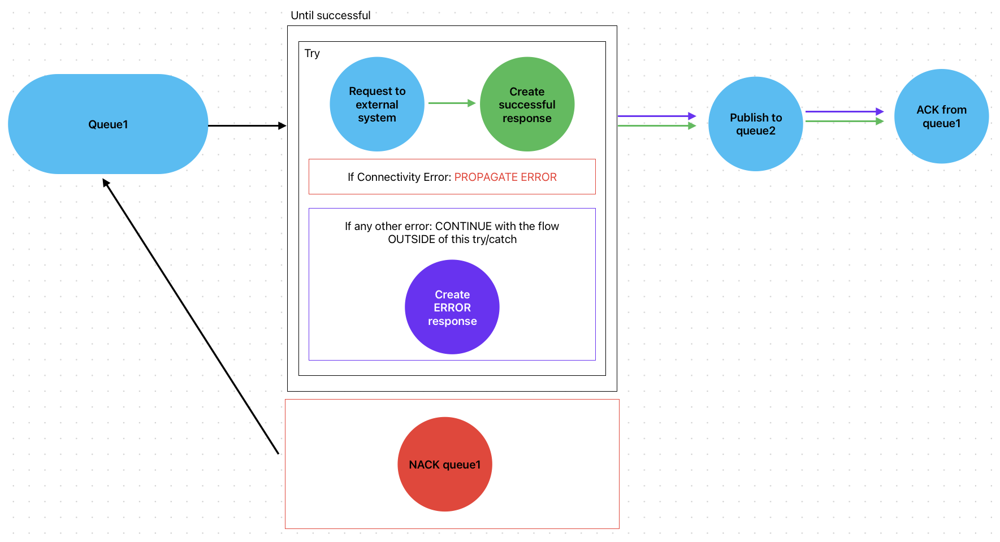

# My process API Munits

Based on my other repo, I used it to generate MUnit tests using [CurieTech AI](https://www.curietech.ai/) and these are the results.

## Similar repos

## Diagram

## The flows

In summary, the main flow has a Subscriber to `queue1`. Once the message is processed, it's attempted to be sent in an HTTP Request to an **HR API**. The issue with this external API, is that it's not reliable and is often down. So, the code challenge was to be able to create a flow that could retry to send the RQ n amount of times before sending the message back to the queue. This was solved with an **Until Successful**.

The second issue is that not all errors should be interpreted or processed the same way. If the API returned a Connectivity error, the flow is supposed to keep trying. But what if it's not a connectivity error and it's a bad request or an internal server error? Then we don't want to keep trying with the same request over and over again. We want to discard it and send an error to the `queue2`.

For this, an Error Continue needed to be put in place.

Now if the error is indeed a connectivity issue, then the error is returned with the **On Error Propagate** to the Until Successful so it can be tried again. But if the error is anything else, like a bad request, then the message is processed as an Error Response and is sent to the `queue2`.

This way, the Until Successful won't be tried again because the message is interpreted as a successful response, but the payload contains the error message.
